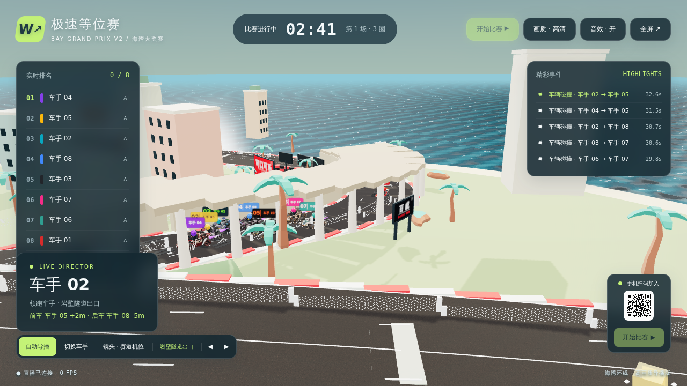
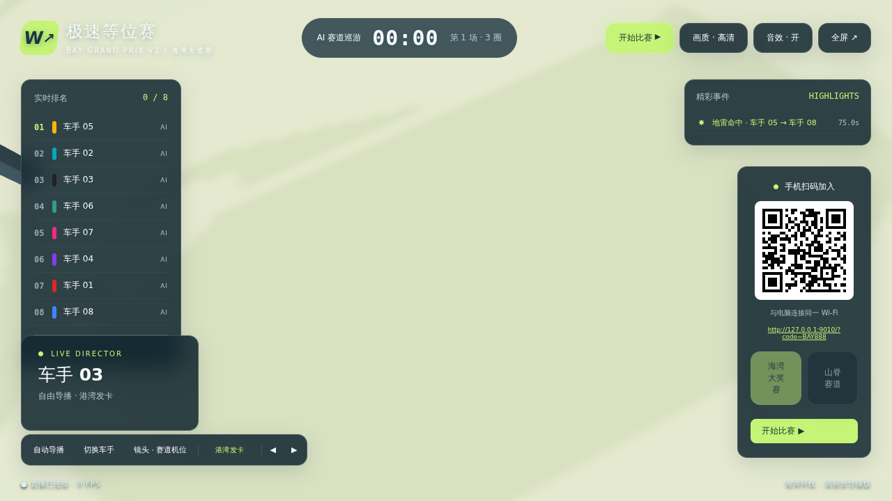
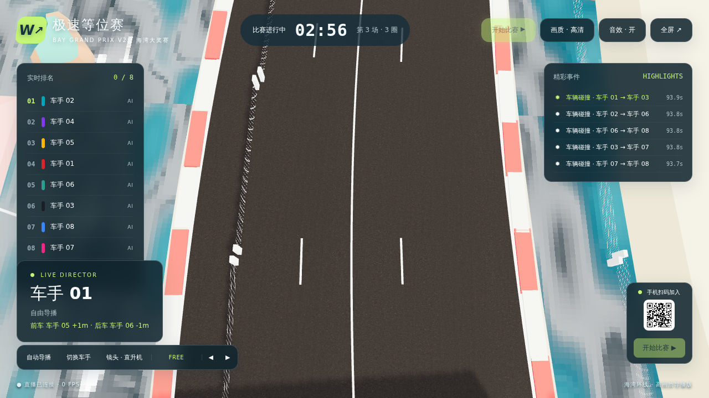

# 极速等位赛 · 海湾大奖赛 V2 样机

2026-09-12，依据负责人本轮要求新增的**单台电脑 + 多手机驾驶视角 + 大屏导播**实验。它是可以试玩的低多边形 3D 街机样机，尚不是跑跑卡丁车体量的完整游戏。

## 启动

```sh
cd /Users/exasdwyh/Documents/VScode/WTGame/repo/pilot-racer
npm ci
npm start
```

电脑打开 `http://localhost:9010/display`，可拖到电视/外接显示器后全屏。手机与电脑连同一 Wi-Fi，用 Safari / Chrome 扫右下角二维码。也可打开启动终端打印的手机链接。无需安装 App 或证书；这是局域网 HTTP/WS 测试，不支持手机通过外网 4G 加入。

如 9010 被占用，`PORT=9011 npm start`。可用 `HOST=127.0.0.1 npm start` 限制为仅本机测试。终端 Ctrl+C 停止。扫码失败时检查同一网络、访客 Wi-Fi 的客户端隔离、系统是否允许 Node 入站；本样机不自动修改防火墙。

## 本轮实现

- **海湾大奖赛 V2 主赛道**：约 1.1 km 单圈，加入长直道制动区、港湾发卡、连续 S、跨海爬升桥、岩壁隧道和下坡高速弯；道路在关键弯位主动收窄，不再是“大椭圆巡游”。8 台卡丁车继续使用同一服务端权威比赛。
- **Visual Art Pass V1（正式生效）**：大屏继续使用 PCFSoftShadowMap，新增本地 `RoomEnvironment + PMREM` IBL，让车漆、金属、玻璃与水面有统一环境反射；原先孤立在 `scenery.mjs` 的慢速动态日照已经接入主循环，太阳方向、天空与雾色会随比赛缓慢变暖。主赛道改用 Poly Haven CC0 1K 柏油 Albedo + Normal PBR，海水使用本地程序生成的动态微法线 + clearcoat，不依赖远程 HDR/CDN。
- **8 车正式 3D 资产车队**：01 赤潮使用保留的 Hyper3D 分件候选 GLB（独立前轮转向/四轮滚动节点继续驱动），02–08 使用 Hyper3D 科技车队轻量 Runtime GLB；如果本地尚未重建 Runtime，02–08 会退到仓库内 Shaded GLB，再失败才回落程序车。大屏加载整队，手机只拉自己的车，服务端碰撞与性能数值完全不受视觉资产影响。
- **100% 防卡键触控系统**：Window 级别多点触控捕获与 Pointer ID 映射表，彻底杜绝单手摇杆+右手高频漂移/道具混触时的滑键、丢包与卡死问题；经 10 分钟 18000 帧长时并发实测无内存泄漏。
- **道具反馈与零依赖音效（视线零遮挡）**：Web Audio API 原生程序化合成（导弹锁定警报、命中轰炸、护盾格挡、漂移摩擦、氮气呼啸与道具拾取）；导弹锁定采用顶部呼吸预警栏，受击采用边缘暗红 Vignette 与微震，驾驶前向视野 100% 清晰透明。
- **导播镜头体系已升级为 TV Director V2**：固定赛道机位之间采用赛事转播式硬切，同一机位内只平滑摇摄；普通竞速优先使用地图机位，导弹/EMP 才切战术俯拍，冲线强制终点机位。
- 手机默认驾驶舱第一人称，可以切换追尾视角。大屏是独立观众，渲染同一场比赛。
- 1–8 真人参与，AI 补齐 8 席。比赛中加入会接管一台 AI 当前的位置和进度，是测试规则，不是公平排位。
- 自动前进与循线辅助。左侧模拟摇杆改变路线，轻推小转、重推大转、松手回中；弯中按住漂移并转向可蓄力，手机 HUD 分别提示「小喷就绪」和「完美 · 松手喷射」，完美漂移提供更强出弯喷射。直道左右摆动蓄力极慢，碰墙或撞雪糕筒会清空蓄力；30 能量触发一次 1.7 秒氮气；减速辅助过弯。
- **走线产生真实收益**：服务器依据弯道曲率计算内外线的实际路程差，守住弯心会获得有限进度优势，直道横向位置不提供奖励；收益封顶在 ±12%，避免极窄发夹弯产生异常捷径。漂移仍能提高弯中抓地上限，因此「外线入弯—切弯心—出弯小喷」比全程贴边更稳定。
- **赛车路线机制 V3**：海湾主赛道增加 3 条偏离常规走线的极速带和 1 个桥顶跳台，必须主动选线才能吃到奖励；跳台进入服务端权威 `jumpUntil`，腾空期间可越过地雷。
- **赛道美术随路线绑定**：码头/游艇、城市街区和近景植被已改为 track-relative 布局，不再使用旧版海湾世界绝对坐标；切换或继续修改中心线时，景观会跟随赛道重建。静态重复物体启用 `batchStaticScenery` 合批，动态灯塔、发车灯、道具箱和 LED 弯道牌显式排除，保证动画不被合批吞掉。
- **尾流超车**：在前车 7–26m、同一车道范围内持续跟车约 1 秒会蓄满尾流；横向抽出尾流后得到短时弹射速度，形成“跟车—抽头—并排”的真实超车节奏。手机端会显示尾流蓄力/弹射提示，大屏继续由导播捕捉超车。
- **道具系统（服务端权威，6 件套）**：赛道 10 个固定点刷道具箱，开箱即 roll（不必等重生），拾取后 8 秒重生；每车最多持有 1 个。六种道具：脉冲飞弹（锁定前方最近车，命中减速 1.6 秒并短暂受击保护）、泡沫地雷（置于车后，触发减速并打转 1.2 秒）、电磁风暴（范围内氮气短暂失效）、能量护盾（3 秒内真实格挡一次飞弹/地雷，0.6 秒内举起算完美格挡并回充能量）、超级氮气、引力牵引（锁定前车磁吸突进，空放只有小喷）。命中与否全部由服务器判定，客户端只发送 `use` 请求。
- **按名次加权掉率 + 末名保底**：P1 以防御与温和道具为主（盾 30 / 氮气 25 / 地雷 25 / 飞弹 10 / 风暴 5 / 牵引 5），P2–4 六种接近均分，P5–7 追击拉满（飞弹 25 / 风暴 20 / 牵引 25 / 氮气 15 / 盾 10 / 地雷 5），末名不出地雷（飞弹 20 / 风暴 15 / 盾 10，其余给牵引与氮气）。连拿末名拾取会累积 pity，牵引与氮气各 +5%/次、最多三层，一脱离末名立刻清零。400 次抽样回归测试已覆盖分布方向与 pity 清零。
- **导播精彩事件**：服务器记录超车/被超车/氮气超车/导弹命中/护盾格挡/地雷命中/最后一圈/冲线/车辆碰撞，每条含 `{type,timestamp,actorId,targetId,position,severity}`；大屏右上角实时显示精彩事件列表。
- **电视赛车导播系统 V2**：服务器只负责“拍谁 / 为什么拍 / 事件优先级”，客户端按当前地图选择真实固定机位。海湾大奖赛配置发车主直道、滨海高速、港湾发卡、跨海爬升桥、中段切线、岩壁隧道出口、下坡连续弯、终点冲刺 8 个赛段机位；山脊赛道也有独立 7 机位模板。固定机位切换使用电视式硬切，同一机位只做平滑摇摄，不再让摄像机从地图一头飞到另一头。普通超车、碰撞、贴身对决优先使用赛段机位，导弹/EMP 等战术事件才进入直升机俯拍，冲线永远切终点机位。对决时摇摄目标取两车中点，保证攻防双方同时入画。镜头仍保留 2 秒快门保底与 3 秒机位保底；保底期间即使焦点故事变化，固定机位本身也不会偷偷跳到另一赛段。
- **自由导播模式**：大屏可关闭自动导播并手动切车手，选择“赛道机位 / 追踪车 / 直升机”三类镜头；赛道机位可用按钮或键盘 `[` / `]` 前后选择。快捷键：`A` 自动导播、`N` 下一车手、`1/2/3` 切赛道机位/追踪/直升机。当前机位名称显示在导播控制条和焦点信息里，方便主持人像赛事导演一样操作。
- **对决条与结算称号**：两车纵向 <22m 且横向 <2.2m 并持续 1.2 秒才触发对决条；短暂拉开（≤30m）不中断，真正拉开后 1.5 秒收起。每场每人恰好一个结算称号：冠军、道具大师、铁壁、超车狂魔、氮气狂徒、末路狂奔或稳步前行。
- **车辆碰撞物理 V2**：不再用“重叠后每帧硬减速”的旧算法。现在按车体纵向/横向穿透做位置修正，带恢复系数的动量交换、侧向冲量与每对车辆碰撞冷却；追尾会把速度传给前车，侧撞会互相挤线，氮气撞击能把对手顶开，但不会两车粘死。
- **接地姿态 V2**：车身按赛道局部坡度俯仰，Hyper3D 车模统一按轮胎最低点对齐路面，接触阴影固定在沥青面；上坡/下坡不再保持水平“悬浮”。
- **车辆动态 V4**：服务端新增车头相对赛道偏角、横向速度和轮胎侧滑角。普通转向使用高抓地快速跟随，漂移降低横向抓地形成真实“车头先转、速度方向后跟”的滑移；横撞、追尾、雪糕筒和墙体都会影响车头姿态。第一人称/追尾镜头按真实车头方向构图，不再像固定在轨道中心线上滑行。
- 服务器统一决定碰撞、进度、能量、道具、完成时间和排名，手机不能上传位置或成绩。
- 4 秒倒计时，3 圈或最多 150 秒比赛，12 秒成绩展示，在线玩家自动再赛。
- 短断线 AI 接管，检测断线后保留席位 15 秒，同标签页恢复原座位；健康连接不被另一个标签页挤下线。长断线按空位重新加入。道具、效果计时器、道具箱、场上道具实体和精彩事件全部进入重连快照。
- 桌面测试：方向键或 A/D 转向，Shift 漂移，空格氮气，E 使用道具，下箭头/S 减速。手机横屏使用左侧摇杆和右侧多点触控按钮。

当前素材均为本项目原创程序几何与程序音效，没有复制跑跑卡丁车角色、模型、音乐、商标或下载开源赛车的资源。

## Visual Preview

GitHub 会用 Playwright 启动真实 Pilot Racer 服务并开始一场权威 AI 满编比赛，然后自动刷新以下截图：

### 自动电视导播



### 自由导播固定机位



### 直升机全景



截图由 `Visual Preview` GitHub Action 从真实 Three.js / WebSocket 运行结果生成，不是设计稿。视觉、车型、赛道或导播有明显改动时会自动更新，也可手动触发工作流。

## Waiting Entertainment Hub 接入

本仓库继续可以独立启动，同时已经补齐 Hub Game Package v1 的运行约定：

- Package id：`pilot-racer`
- 本地运行目录变量：`PILOT_RACER_DIR`
- 默认端口：`9010`
- 健康检查：`GET /info`
- 主持人开局动作：`POST /api/start`
- Hub 启动进程时会把当前轮次码写入 `ROOM_CODE`
- 大屏以 `/display?hub=1` 嵌入时隐藏赛车自己的永久二维码和开始按钮
- Hub 报名页传入 `?hub=1&name=<昵称>` 时，手机页直接以该昵称进入赛车等候区，不再让顾客重复填写一次

推荐现场流程是“Hub 开放报名 → 锁定阵容并预热赛车进程 → 已报名顾客进入发车等候区 → 主持人统一开局”。赛车仍然只负责自己的比赛、物理、AI、手机控制与导播；餐厅等位/叫号由 Hub 独立管理。

## 验证

```sh
npm run check
```

102 项测试涵盖闭合赛道、倒计时/完成/再赛、输入校验和过期、氮气消耗、碰撞事件、整圈驾驶方向、摇杆死区与行程、**弯道漂移两档蓄力、直道刷气抑制、漂移输入超时清空、内外线进度收益与 ±12% 上限**、道具箱拾取与 8 秒重生、服务端道具使用判定、飞弹锁定与命中减速、护盾真实格挡与完美格挡回能、地雷命中打转与腾空躲避、电磁风暴压制氮气、牵引锁定、**按名次加权掉率与末名 pity 的 400 次抽样**、精彩事件结构与稳定递增 id、**导播镜头保底（2 秒快门保底会推迟高 severity 事件、3 秒机位保底不换角度但会换主体、冲线不受保底限制）**、**对决条的成形/抗抖动/延后收起**、**结算称号的唯一性与优先级**、快照字段（含 `duel`/`awards`），以及真实 WebSocket 的八人席位/第九人拒绝/观众权限/恢复/道具使用/静态文件边界。浏览器中另验了加入、实时比赛与第一人称界面，检查了 844×390 横屏布局、拖动无文字选择与摇杆回中。

手机端直接使用横屏驾驶界面，用户自行横握手机。游戏区域禁止选字和长按菜单，昵称输入仍可编辑。本轮新增道具与精彩事件，服务端与手机/大屏页面都有改动：手机和大屏页面需刷新加载新版，服务端也需重启一次。

导播三件套另做了一次浏览器端到端验收（无头 Chrome + 真实服务端 + 真实 8 台 AI 比赛）：对决条在比赛中真实出现 3 组对阵、焦点镜头依次经过「贴身对决 / 并排争夺 / 最后一圈 / 冲线时刻」、结算面板 8 行全部带称号，页面零异常。截图与原始日志见 [验收记录](../docs/reviews/pilot-racer-director-acceptance-2026-09-12.md)。

未验证：真实手机 GPU/发热/耗电、触控到画面的 p95 延迟、八台真机并发、丢包、Windows 设备性能和长时间运行。旧 Godot 链路的延迟数据不能用于证明本样机达标。界面 FPS 为当前浏览器估算帧率，不是手机性能报告。

## 边界与架构

详见 [ADR-003](../docs/adr/ADR-003-phone-3d-pilot.md)。本目录使用独立 `pilot-racer/1` 协议，**不兼容**旧 `contracts/protocol-v1.md`，也不接入旧生产身份/门店授权。`controller/`、`display/`、`realtime/` 可继续原样启动。

仅用于可信同一局域网的有人值守样机，不应直接暴露公网。加入码与恢复令牌是临时测试凭据，不是正式多租户鉴权；未接入设备、订阅、奖励、运营后台或自动发布。

下一次真机验收优先记录：手机型号和浏览器、8 人并发帧率、输入到画面的延迟、连续 10 分钟是否发热、玩家能否理解漂移/超车。通过后再投入精细模型、更自由的转向、道具、音效、赛道变化和正式部署。
