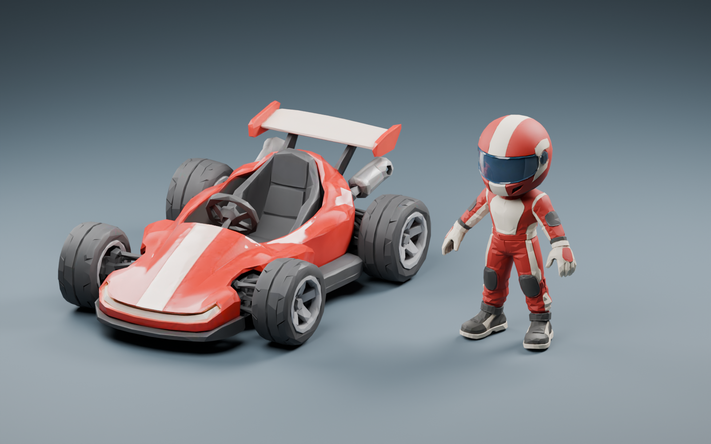

# Hyper3D 第一版候选验收

2026-09-19。本轮交付卡丁车与独立驾驶员模型，不替换运行时旧模型。



## 结论

生成与静态资产检查完成；拆分车体可继续进行动画接入，驾驶员需要另做骨骼、坐姿和握盘。尚未证明新模型在当前游戏灯光、远景和手机性能上全面优于程序模型，因此不批准替换车 01。没有修改 `public/app.mjs`、`public/simulation.mjs`、`public/styles.css` 或 `server.mjs`，协议和权威碰撞完全不变。

## 实际交付

| 项目 | 拆分卡丁车 | 驾驶员 |
|---|---|---|
| 面数 | 10,000 三角面 | 6,000 三角面 |
| 网格 / 材质 | 8 / 1 | 1 / 1 |
| 文件大小 | 911,604 字节 | 500,624 字节 |
| 贴图 | 三张内嵌 1024 PBR 图 | 三张内嵌 1024 PBR 图 |
| 尺寸，Three.js X/Y/Z | 2.556 / 1.294 / 3.900 | 1.435 / 2.250 / 0.757 |
| 姿态与方向 | Y 向上，+Z 车头，四轮落地 | Y 向上，+Z 面向，A 姿态 |
| 动态准备 | 四轮轮心、前轮转向父节点、尾翼转轴 | 无骨骼、无动画，不伪称已绑定 |

两份推荐轻量文件合计 1,412,228 字节，约 1.41 MB；保留未拆分车体用于比较。源文件仍完整保留，三个任务均成功，没有遇到积分不足。连接器不提供实际余额/扣费金额，未编造积分消费数。

## 已检查与发现

- 已人工查看正面、侧面、背面：前脸灯带、空座舱、尾翼、双喷口可识别；未生成多余驾驶员、漂浮部件或粘住躯干的四肢。
- 原始车是单个连通网格，不满足独立车轮动作要求。检查后仅调用一次 BANG，得到车身、四轮、尾翼、两喷口，面数仍为 10,000。
- BANG 的八份材质实际引用同一套纹理和相同采样设置；本地合并为一份共享材质。仍需 8 次基础网格绘制，不能称为 1 draw call。
- 统一接地点，轮心位置与前轮转向节点分离；22 度静态转向检查图为 `kart-parts-steering.png`。这不是连续运动、完整滚轮或悬挂验收。
- 重新导入最终压缩 GLB 渲染 `candidates-board.png`，确认导出文件可读取且纹理完整。
- **美术保留问题**：车壳与尾部近景仍有明显的折面高光，接入前应打磨法线/局部拓扑；驾驶员坐进车内的头身比例、双手握盘和衣服变形尚未验证。
- 前灯在当前候选中主要是浅色材质形状；没有把额外发光贴图伪称为已接入。尾焰、编号、护盾仍应由现有 Three.js 效果系统负责。
- 文件体积不是显存开销。两资产六张 1024 RGBA 纹理连同 mipmap 可约占 32 MiB（估算，非实测）；应共享资源，不能给八台车各复制一套贴图，也不能据此承诺手机帧率。

## 接入节点契约

`KartVisualRoot` 为外观根，中心落地点位于原点；沿用服务器的抽象车辆碰撞。

- `kart_body`：车身/座舱/固定方向盘。
- `steer_front_xpos`、`steer_front_xneg`：Three.js 局部 Y 轴转向。
- `wheel_front_xpos`、`wheel_front_xneg`：对应转向节点的子物体，局部 X 轴滚动。
- `wheel_rear_xpos`、`wheel_rear_xneg`：局部 X 轴滚动。
- `rear_wing`：独立尾翼转轴。
- `exhaust_xpos`、`exhaust_xneg`：可定位尾焰，尚未挂接效果。

X 正负命名避免车手左/右与镜头左/右混淆。没有改动已有 `frontPivots`、`wheelGroups`、`bodyGroup` 等运行时接口。

## 验证

- 初次沙箱运行无法完成需要监听本机端口的联机测试；获得本机运行权限后，原有 **69/69** 全过。
- 新增三项资产测试：两份静态候选的自包含纹理/体积/面数/尺寸，以及拆分车的独立轮心/转向层级。
- 最终 `npm run check`：**72 passed, 0 failed**。
- 未完成：Three.js 实际比赛灯光验收、旧车并排比较、驾驶员绑定、连续动画检查、八车资源复用压力测试、真实手机 GPU/发热/功耗。当前游戏不会下载这些候选。

## 复现

使用本机 Blender 5.2.1 LTS：

```sh
blender --background --factory-startup --python scripts/inspect_hyper3d_candidates.py
blender --background --factory-startup --python scripts/render_hyper3d_board.py
npm run check
```

工具链：Hyper3D Rodin/BANG；`imagegen` 制作原始参考图；按 `threejs-3d-generator` 的分阶段检查与恢复要求保存任务和资产。未使用 Tripo，也未调用其自动绑定。

下一独立任务建议：驾驶员骨骼/坐姿/握盘 + 大屏专用旧车并排预览；Sol / medium 实施，Terra / medium 复核。当前未发生独立模型复核，不以此报告冒充。
