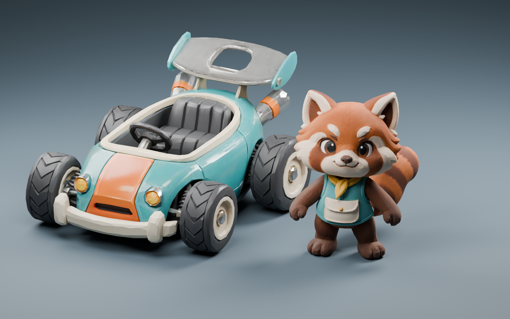

# 小熊猫快递员 × 拉环罐头车：首轮候选

状态：完成两张原创参考图、两份 Hyper3D GLB、本地轻量化和静态检查；未接入比赛。



## 结果

|资产|三角面|文件大小|网格/材质|贴图|
|---|---:|---:|---|---|
|tin-panda-kart-candidate.glb|18,000|1,396,012 bytes|1 / 1|3 × 1024|
|tin-panda-driver-candidate.glb|10,000|559,840 bytes|1 / 1|3 × 1024|

车辆长 3.9，宽约 2.876，高约 1.848；角色站高 2.25（尾巴使纵深约 2.172）。模型 Y-up，车头朝 +Z，包围盒脚底归零、水平中心归零。角色原点目前按包括尾巴的包围盒居中，坐姿装配时必须重新校准躯干/座椅锚点。

## 视觉判断与剩余问题

- 保留青绿/奶油/橙色块、拉环尾翼、粗轮胎；小熊猫保留表情、面罩、背心和环纹尾巴。轮廓更有角色感，但不是概念图同等精细度。
- 车壳高光、尾翼孔缘、保险杠和角色耳部/手脚有可见折面，需法线与局部拓扑打磨，不应以静态预算通过替代美术验收。
- 车辆焊接后只有一个连通网格，四轮不可独立转动；尚未追加付费拆分。后续拆分后必须逐轮检查轮心、接地和平滑转向。
- 角色为无骨骼站姿，手臂与身体间留空；尾巴较长。必须完成坐姿、握盘、尾巴避让和动画验证后才适合驾驶。
- 当前车辆宽度大于原程序车约 2.46 的外观宽度，接入前需适配外观包络，不能扩大权威碰撞框来迁就模型。
- 当前仅为 Blender 静态与 GLB 结构验收，没有真实手机帧率、Eight-car draw call、远景游戏对比或游戏灯光验收。

## 工程与复现

原始文件保留在 assets/models/tin-panda-2026-09-19/source/；仅候选贴图降至 1024，JPEG quality 85，归一化尺度、原点后导出。未做自动细分，也未凭空声称已绑定。所有旧红白候选和实时游戏代码保留。

```bash
blender --background --factory-startup --python scripts/inspect_hyper3d_candidates.py -- --collection tin-panda-2026-09-19 --prefix tin-panda
blender --background --factory-startup --python scripts/render_hyper3d_board.py -- --collection tin-panda-2026-09-19 --prefix tin-panda --kart-kind kart
npm run check
```

验证：74 passed, 0 failed，包含新增两个候选的嵌入资源、贴图上限、面数、体积、坐标和无骨骼声明检查。遵循分阶段资产检查流程，在动画前停留于候选阶段，未批量生成其余两组。
